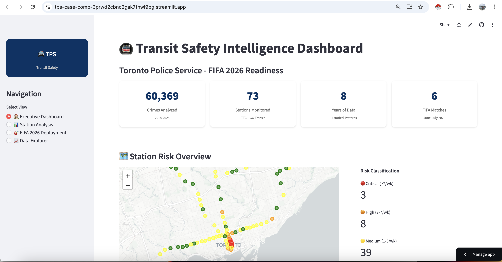

# 🚔 TPS Transit Safety Intelligence — FIFA 2026 Officer Deployment

<div align="center">

**Toronto Police Service · Case Competition Project**

*An end-to-end data science system built on 8 years of real crime data — delivering a station-by-station, match-by-match officer deployment plan for all 6 FIFA 2026 World Cup matches in Toronto.*

[](https://python.org)
[](https://streamlit.io)
[](https://python-visualization.github.io/folium/)
[](https://pandas.pydata.org)
[](https://plotly.com)
[](https://jupyter.org)

</div>

---

## 📌 Project Overview

**Client:** Toronto Police Service (TPS)  
**Event:** FIFA 2026 World Cup — 6 group-stage matches at BMO Field, Toronto  
**Challenge:** Using historical open crime data, determine where and when TPS should deploy officers across the TTC subway network for each FIFA match — with no prior FIFA Toronto data to reference.

This project delivers a **complete, operational answer**: a data-driven deployment recommendation system built on 316,478 crime records across all 73 TTC subway stations, presented through a 4-page interactive Streamlit dashboard with live geospatial mapping.

---

## 🖼️ Dashboard Preview



*4-page interactive Streamlit dashboard — live Folium geospatial risk map, station-level crime profiles, FIFA 2026 match-by-match deployment planner, and adaptive strategy framework for TPS command.*

---

## 🧠 Skills at a Glance

| Skill Area | What Was Done |
|---|---|
| **Data Engineering** | Ingested & cleaned 452,949 crime records; resolved duplicates; merged 3 disparate datasets |
| **Geospatial Analysis** | 500m geodesic spatial join linking crimes to 73 TTC stations; haversine distance to 3 major venues |
| **Statistical Modelling** | Anomaly detection to identify true event-day crime amplification; improved on naive baseline proxy |
| **Feature Engineering** | Derived temporal features: late-night flag, weekend multiplier, event-proxy, danger windows |
| **Predictive Analytics** | Station risk scoring, event amplification modelling, officer deployment formula with sensitivity analysis |
| **Interactive Dashboards** | 4-page Streamlit app with live Folium maps, Plotly charts, dynamic KPIs, and CSV export |
| **Uncertainty Quantification** | Sensitivity analysis across multiple capacity assumptions → full deployment uncertainty range |
| **Business Communication** | Translated statistical outputs into per-match, per-station operational recommendations for TPS command |

---

## 📊 Project Scale

| Metric | Value |
|---|---|
| Crime records processed | 316,478 (from 452,949 total) |
| TTC stations analysed | 73 — 100% coordinate coverage |
| Transit-related crimes identified | 60,369 via 500m spatial join |
| Data coverage | 98.5% coordinate accuracy |
| Highest-risk station | DUNDAS |
| Critical-risk stations identified | 3 (DUNDAS, COLLEGE, QUEEN) |
| FIFA-corridor stations mapped | 15 |
| Peak crime hour (network-wide) | 00:00 midnight |
| Peak crime day | Friday |
| Historical data span | 8 years (2018–2025) |

---

## ✨ Key Features

### 🗺️ 1. Interactive Geospatial Risk Map ⭐
All 73 TTC stations rendered on a live **Folium map** (CartoDB Positron basemap). Each station is a `CircleMarker` — radius scales with weekly crime frequency, colour encodes a 4-tier risk system:

> 🔴 **Critical** &nbsp;·&nbsp; 🟠 **High** &nbsp;·&nbsp; 🟡 **Medium** &nbsp;·&nbsp; 🟢 **Low**

Click any station for an interactive popup: name, risk tier, crimes/week, total crime count. Radius dynamically clamped with graceful Plotly fallback if coordinates are missing.

---

### 📋 2. Station-Level Risk Profiling
Each of the 73 stations receives a complete risk profile: total crimes, crimes/week, weekday vs. weekend rates, late-night crime percentage (22:00–02:00), and geodesic distances to BMO Field, Scotiabank Arena, and Rogers Centre.

Not all stations are risky at the same time or for the same reasons — a commuter-peak station needs different resourcing than a nightlife-driven one. Profiles allow commanders to match officer skill sets and shift patterns to station-specific risk.

---

### ⏰ 3. Temporal Danger Windows
Identifies the single 3-hour peak crime window per station (e.g., DUNDAS: `00:00–03:00`, ST ANDREW: `21:00–00:00`) and shows what share of daily crime concentrates in that window.

This enables surgical deployment — officers can be redeployed across the network as post-match crowds disperse through the system, rather than remaining statically assigned for full 8-hour shifts.

---

### ⚽ 4. FIFA Corridor Analysis
Identifies 15 TTC stations in the FIFA 2026 fan movement corridor, grouped into three tiers:

| Tier | Stations |
|---|---|
| BMO Corridor | Stations within 3.5km of BMO Field |
| Major Transfer Points | Bloor-Yonge, Union, St. George, Spadina |
| Downtown Hubs | Dundas, College, Queen, Wellesley |

> **Key Insight:** No TTC station is within 2km of BMO Field — the closest is ST ANDREW at 3.1km. Fans travel *through* downtown hubs rather than directly to the venue, which fundamentally shifts the deployment strategy from venue-perimeter to corridor-based coverage.

---

### 📈 5. Event Amplification Modelling
Replaces a naive day-of-week proxy with a rigorous **anomaly detection approach** — identifying true sporting event days using z-score thresholds against day-of-week baselines. The resulting amplification factor is statistically defensible and auditable for budget committees, rather than a rough assumption.

---

### 🚔 6. Match-by-Match Deployment Planner
For each of the 6 FIFA matches (Jun 12 – Jul 2, 2026), the planner outputs the recommended officer count, stations covered, risk classification, and critical deployment window. Three scenarios are presented side-by-side:

| Scenario | Use Case |
|---|---|
| Conservative | Lean budget, lower-risk matches |
| **Balanced** ✅ | Recommended standard deployment |
| Aggressive | High-risk matches, high crowd density |

**Deployment Formula:**

```
officers = ceil( (event_rate × match_risk × fifa_factor) / capacity )
```

---

### 🔄 7. Adaptive Learning Framework
Structures the 6 matches into 3 phases rather than locking in a fixed plan:

| Phase | Matches | Action |
|---|---|---|
| Test | Match 1 | Deploy baseline, record actuals vs. predicted |
| Adjust | Matches 2–3 | Reallocate based on Match 1 empirical data |
| Optimise | Matches 4–6 | Deploy using validated, match-tested multipliers |

Since FIFA 2026 is Toronto's first FIFA World Cup, this converts Match 1 into a *learning opportunity* rather than a commitment to an unvalidated static plan across all 6 matches.

---

### 📉 8. Sensitivity Analysis
Tests deployment totals across a range of officer capacity assumptions, producing an honest uncertainty range rather than a single point estimate. This allows TPS command to make risk-informed budgeting decisions that account for real operational variability.

---

## 🔬 Analytical Pipeline

10 modular Jupyter notebooks — each reads from `data/` or prior outputs and writes to `outputs/`. The Streamlit dashboard reads exclusively from `outputs/`, keeping the pipeline and presentation cleanly separated.

```
Module 01 → Data Loading & Quality Validation       (452,949 records, 98.5% coordinate coverage)
Module 02 → Station Standardization & Fuzzy Match   (73 stations, ridership fusion)
Module 03 → Spatial Join — 500m Geodesic Radius     (60,369 transit crimes linked)
Module 04 → Temporal Feature Engineering            (weekend, late-night, event-proxy flags)
Module 05 → Station Risk Profiling                  (crimes/week, danger tiers, venue distances)
Module 06 → Temporal Heatmap Analysis               (hour × day crime density matrix)
Module 07 → FIFA Corridor Analysis                  (15 stations, 3-tier proximity scoring)
Module 09 → Event Amplification Detection           (anomaly detection, z-score thresholds)
Module 10 → FIFA Deployment Planning                (match-by-match plan, 3 scenarios)
Module 11 → Sensitivity Analysis                    (full uncertainty range)
```

---

## 📁 Project Structure

```
TPS_CaseComp/
├── data/
│   ├── major-crime-indicators.csv              # TPS crime records (2000–2025) — 452,949 rows
│   ├── subway-stations.csv                     # TTC station coordinates
│   ├── ttc-ridership.csv                       # Annual ridership by station/line
│   ├── toronto_fifa_2026_events.csv            # FIFA 2026 match schedule (BMO Field)
│   └── 02_master_station_list.csv              # Processed master station list (73 stations)
│
├── modules/
│   ├── 01_data_loading_and_sanity_checks.ipynb
│   ├── 02_station_standardization.ipynb
│   ├── 03_spatial_join.ipynb
│   ├── 04_temporal_features.ipynb
│   ├── 05_station_risk_profiling.ipynb
│   ├── 06_temporal_heatmap.ipynb
│   ├── 07_fifa_corridor.ipynb
│   ├── 09_event_amplification.ipynb
│   ├── 10_fifa_deployment.ipynb
│   └── 11_sensitivity_analysis.ipynb
│
├── outputs/
│   ├── 05_station_risk_profiles.csv            # Risk scores for all 73 stations
│   ├── 06_station_danger_windows.csv           # Per-station 3-hour peak crime windows
│   ├── 07_fifa_affected_stations.csv           # All 15 FIFA-corridor stations
│   ├── 07_fifa_priority_stations.csv           # Stations ranked by FIFA risk score
│   ├── 09_event_amplification.csv              # Event-day amplification factors
│   ├── 10_fifa_deployment_schedule_UPDATED.csv # Final match-by-match deployment plan
│   ├── 10_deployment_scenarios_UPDATED.csv     # Conservative / Balanced / Aggressive
│   ├── 11_sensitivity_analysis_results.csv
│   └── 11_sensitivity_analysis_plot.png
│
├── images/
│   └── dashboard_screenshot.png                # ← Add your screenshot here
│
├── app_new.py                                  # Main Streamlit dashboard (4 pages)
├── requirements.txt
├── PIPELINE_ANALYSIS_AND_PRESENTATION.md       # Judge presentation guide
└── README.md
```

---

## 🛠️ Tech Stack

| Category | Tools |
|---|---|
| **Language** | Python 3.8+ |
| **Dashboard** | Streamlit |
| **Geospatial Mapping** | Folium, streamlit-folium |
| **Data Processing** | Pandas, NumPy |
| **Visualisation** | Plotly Express, Plotly Graph Objects |
| **Pipeline** | Jupyter Notebooks (10 modules) |
| **Spatial Analysis** | Geodesic distance (haversine), 500m radius spatial join |
| **Statistical Methods** | Anomaly detection (z-score), fuzzy string matching |
| **Styling** | Custom CSS (TPS blue branding `#003366`) |

---

## 🔧 Installation

```bash
# 1. Clone the repository
git clone https://github.com/your-username/tps-transit-safety.git
cd tps-transit-safety

# 2. Create and activate a virtual environment
python -m venv venv
source venv/bin/activate        # macOS/Linux
# venv\Scripts\activate         # Windows

# 3. Install dependencies
pip install --upgrade pip
pip install -r requirements.txt

# 4. Verify installation
python -c "import streamlit, pandas, numpy, plotly, folium; print('All dependencies ready.')"
```

**`requirements.txt`**
```
streamlit>=1.28.0
pandas>=2.0.0
numpy>=1.24.0
plotly>=5.18.0
folium>=0.15.0
streamlit-folium>=0.15.0
openpyxl>=3.1.0
```

---

## 🏃 Running the Application

> **Step 1:** Run all 10 pipeline notebooks in order (Modules 01 → 11) to generate the `outputs/` folder.

> **Step 2:** Launch the dashboard.

```bash
# Must be run from project root so outputs/ is found correctly
cd TPS_CaseComp/
streamlit run app_new.py
```

Opens at **http://localhost:8501**

---

## 📊 Dashboard Guide

| Page | What You See | When to Use |
|---|---|---|
| 🏠 **Executive Dashboard** | Folium risk map of all 73 stations + KPI cards + top 10 stations | Network-wide situational awareness |
| 📊 **Station Analysis** | Full risk profile, danger window, venue distances for any station | Pre-match planning for a specific location |
| 🎯 **FIFA 2026 Deployment** | Match-by-match officer counts, windows, and 3 scenarios | Operational planning for each match day |
| 📈 **Data Explorer** | Filterable raw tables, CSV download for all outputs | Analyst export for internal TPS reporting |

---

## 📂 Data Sources

All data sourced from open public portals:

- **TPS Major Crime Indicators** — 452,949 records, 2000–2025 · [TPS Open Data Portal](https://data.torontopolice.on.ca/)
- **TTC Subway Stations & Ridership** — coordinates and annual ridership · [City of Toronto Open Data](https://open.toronto.ca/)
- **FIFA 2026 Match Schedule** — BMO Field, Toronto · [FIFA Official](https://www.fifa.com/en/tournaments/mens/worldcup/canadamexicousa2026)

---

## 🛠️ Troubleshooting

| Issue | Fix |
|---|---|
| `outputs/` not found | Run from project root: `cd TPS_CaseComp/ && streamlit run app_new.py` |
| `ModuleNotFoundError: folium` | `pip install folium streamlit-folium --upgrade` |
| Map renders blank | Re-run Module 05 to regenerate `05_station_risk_profiles.csv` with lat/lon |
| Memory error on crime CSV | Ensure 4GB+ RAM; filter to post-2018 in Module 01 if needed |
| Stale dashboard after re-running notebooks | `streamlit cache clear` |

---

## 📄 License

Developed for the **Toronto Police Service Case Competition**. Crime data sourced from the [TPS Public Safety Data Portal](https://data.torontopolice.on.ca/) and [City of Toronto Open Data](https://open.toronto.ca/). Not affiliated with or endorsed by the Toronto Police Service.

---

<div align="center">

**Toronto Police Service — Transit Safety Intelligence**

316,478 Crimes &nbsp;·&nbsp; 73 TTC Stations &nbsp;·&nbsp; 8 Years of Data &nbsp;·&nbsp; FIFA 2026 Ready

*Built with Python · Streamlit · Folium · Plotly · Pandas*

</div>
